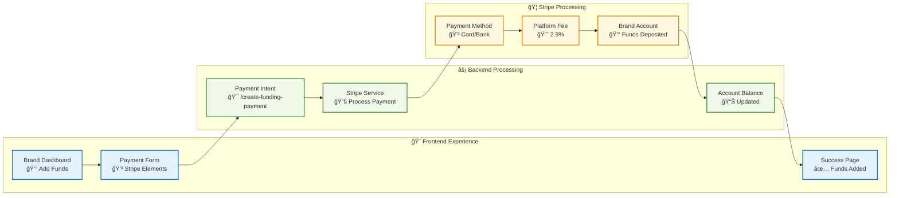

# 🚀 Fohr Platform - Stripe Connect Integration

A comprehensive Node.js backend service that enables brands to fund their accounts and pay influencers through Stripe Connect. Built with Express.js and modular architecture for scalability and maintainability.

## 📋 Table of Contents

- [Features](#-features)
- [Architecture](#-architecture)
- [API Endpoints](#-api-endpoints)
- [Setup & Installation](#-setup--installation)
- [Usage Examples](#-usage-examples)
- [Payment Flows](#-payment-flows)
- [Security](#-security)
- [Contributing](#-contributing)

## ✨ Features

- **🔗 Stripe Connect Integration** - Full Connect platform for multi-party payments
- **💰 Account Funding** - Brands can fund their accounts with platform fees
- **💸 Influencer Payments** - Direct payments to influencers with fee management
- **🔐 Secure Webhooks** - Signature verification and event processing
- **📊 Account Management** - Balance checking, transfer history, and payouts
- **🏗️ Modular Architecture** - Clean separation of concerns with Express Router

## 🏗️ Architecture

### System Overview

```mermaid
graph TB
    subgraph "🌐 Frontend Layer"
        FE["React Application<br/>📱 Brand Dashboard"]
        STRIPE_JS["Stripe.js<br/>💳 Payment Elements"]
    end

    subgraph "🔗 API Gateway"
        API["Express.js Server<br/>⚡ Port 4000"]
    end

    subgraph "🔧 Business Logic"
        ROUTES["Route Handlers<br/>📋 /routes/stripe.js"]
        SERVICE["Stripe Service<br/>⚙️ /services/stripe.js"]
    end

    subgraph "🏦 External Services"
        STRIPE["Stripe Connect<br/>💰 Payment Processing"]
        WEBHOOKS["Stripe Webhooks<br/>📡 Event Handling"]
    end

    subgraph "💾 Data Layer"
        DB[("Database<br/>🗄️ Brand Accounts")]
    end

    FE -->|"HTTP Requests"| API
    STRIPE_JS -->|"Payment Intents"| STRIPE
    API --> ROUTES
    ROUTES --> SERVICE
    SERVICE --> STRIPE
    STRIPE --> WEBHOOKS
    WEBHOOKS --> API
    API --> DB

    classDef frontend fill:#e1f5fe,stroke:#01579b,stroke-width:3px,color:#000
    classDef backend fill:#f3e5f5,stroke:#4a148c,stroke-width:3px,color:#000
    classDef external fill:#fff3e0,stroke:#e65100,stroke-width:3px,color:#000
    classDef database fill:#e8f5e8,stroke:#1b5e20,stroke-width:3px,color:#000

    class FE,STRIPE_JS frontend
    class API,ROUTES,SERVICE backend
    class STRIPE,WEBHOOKS external
    class DB database
```



## 🎯 Payment Flows

### Brand Onboarding Flow

```mermaid
sequenceDiagram
    participant B as 🏢 Brand
    participant FE as 📱 React App
    participant API as ⚡ Express API
    participant STRIPE as 🏦 Stripe Connect
    participant DB as 🗄️ Database

    Note over B,DB: Brand Registration & Onboarding

    B->>FE: Sign Up for Platform
    FE->>API: POST /stripe/create-account
    Note right of API: {email, name, country, type}

    API->>STRIPE: Create Connect Account
    STRIPE-->>API: Account ID & Details
    API->>DB: Store Account Info
    API-->>FE: Account Created Successfully

    FE->>API: POST /stripe/create-account-link
    API->>STRIPE: Generate Onboarding Link
    STRIPE-->>API: Onboarding URL
    API-->>FE: Redirect URL

    FE->>B: Redirect to Stripe Onboarding
    B->>STRIPE: Complete KYC & Verification
    STRIPE->>API: Webhook: account.updated
    API->>DB: Update Account Status
    API-->>STRIPE: Webhook Acknowledged

    Note over B,DB: Brand is now ready to fund and pay!
```



### Account Funding Flow



### Influencer Payment Flow

```mermaid
flowchart TD
    Start([🎬 Campaign Completed]) --> Check{💰 Brand Has<br/>Sufficient Funds?}

    Check -->|❌ No| Insufficient[💳 Prompt Brand<br/>to Add Funds]
    Insufficient --> Funding[💰 Account Funding Flow]
    Funding --> Check

    Check -->|✅ Yes| Create[🎯 Create Payment Intent<br/>/create-influencer-payment]

    Create --> Process[⚡ Process Payment<br/>Brand → Influencer]
    Process --> Fee[📊 Platform Fee<br/>2.9% to Fohr]
    Process --> Transfer[💸 Transfer to<br/>Influencer Account]

    Transfer --> Notify[📧 Send Payment<br/>Confirmation]
    Notify --> Complete([✅ Payment Complete])

    classDef start fill:#e8f5e8,stroke:#2e7d32,stroke-width:3px
    classDef process fill:#fff3e0,stroke:#f57c00,stroke-width:2px
    classDef decision fill:#e1f5fe,stroke:#0277bd,stroke-width:2px
    classDef end fill:#f3e5f5,stroke:#7b1fa2,stroke-width:3px

    class Start,Complete start
    class Create,Process,Fee,Transfer,Notify process
    class Check decision
    class Insufficient,Funding end
```

### Webhook Event Processing

```mermaid
graph TB
    subgraph "📡 Stripe Webhooks"
        WH1[account.updated]
        WH2[payment_intent.succeeded]
        WH3[transfer.created]
        WH4[payout.created]
    end

    subgraph "🔒 Security Layer"
        SIG[Signature Verification<br/>🔐 whsec_...]
    end

    subgraph "⚡ Event Handler"
        ROUTER[Webhook Router<br/>/stripe/webhook]
        PROCESS[Event Processing<br/>📋 Switch Statement]
    end

    subgraph "💾 Database Updates"
        ACCOUNT[Update Account Status<br/>🗄️ brands table]
        PAYMENT[Log Payment Events<br/>📊 transactions table]
        TRANSFER[Update Transfer Status<br/>💸 transfers table]
    end

    WH1 --> SIG
    WH2 --> SIG
    WH3 --> SIG
    WH4 --> SIG

    SIG --> ROUTER
    ROUTER --> PROCESS

    PROCESS -->|account.updated| ACCOUNT
    PROCESS -->|payment_intent.succeeded| PAYMENT
    PROCESS -->|transfer.created| TRANSFER
    PROCESS -->|payout.created| PAYMENT

    classDef webhook fill:#ffebee,stroke:#c62828,stroke-width:2px
    classDef security fill:#e8f5e8,stroke:#2e7d32,stroke-width:3px
    classDef handler fill:#e3f2fd,stroke:#1565c0,stroke-width:2px
    classDef database fill:#fff3e0,stroke:#ef6c00,stroke-width:2px

    class WH1,WH2,WH3,WH4 webhook
    class SIG security
    class ROUTER,PROCESS handler
    class ACCOUNT,PAYMENT,TRANSFER database
```



## 🔌 API Endpoints

### Account Management

#### Create Stripe Connect Account

```http
POST /stripe/create-account
Content-Type: application/json

{
  "email": "brand@example.com",
  "name": "Brand Name",
  "country": "US",
  "type": "express"
}
```

#### Create Account Onboarding Link

```http
POST /stripe/create-account-link
Content-Type: application/json

{
  "accountId": "acct_...",
  "refreshUrl": "https://yourdomain.com/onboarding/refresh",
  "returnUrl": "https://yourdomain.com/onboarding/success"
}
```

#### Create Login Link

```http
POST /stripe/create-login-link
Content-Type: application/json

{
  "accountId": "acct_..."
}
```

### Payment Processing

#### Fund Brand Account

```http
POST /stripe/create-funding-payment
Content-Type: application/json

{
  "amount": 10000,  // $100.00 in cents
  "currency": "usd",
  "brandAccountId": "acct_...",
  "metadata": {
    "campaignId": "123",
    "brandId": "456"
  }
}
```

#### Pay Influencer

```http
POST /stripe/create-influencer-payment
Content-Type: application/json

{
  "amount": 5000,  // $50.00 in cents
  "currency": "usd",
  "influencerAccountId": "acct_...",
  "brandAccountId": "acct_...",
  "metadata": {
    "campaignId": "123",
    "influencerId": "789",
    "deliverableId": "101"
  }
}
```

### Account Information

#### Get Account Details

```http
GET /stripe/account/{accountId}
```

#### Get Account Balance

```http
GET /stripe/account/{accountId}/balance
```

#### List Transfers

```http
GET /stripe/account/{accountId}/transfers?limit=10&starting_after=tr_...
```

## 🚀 Setup & Installation

### Prerequisites

- Node.js 14+
- npm or yarn
- Stripe account with Connect enabled

### Installation

1. **Clone the repository**

```bash
git clone <repository-url>
cd fohr-nodejs
```

2. **Install dependencies**

```bash
npm install
```

3. **Environment Variables**
   Create a `.env` file with:

```bash
# Stripe Configuration
STRIPE_SECRET_KEY=sk_test_...
STRIPE_PUBLISHABLE_KEY=pk_test_...
STRIPE_WEBHOOK_SECRET=whsec_...

# Server Configuration
PORT=4000
```

4. **Start the server**

```bash
npm start
# or for development
npm run start:dev
```

### Stripe Dashboard Setup

1. Enable Connect in your Stripe Dashboard
2. Configure Connect settings:

   - Platform name: "Fohr"
   - Platform website: Your website URL
   - Business type: Select appropriate type

3. Set up webhook endpoint:
   - URL: `https://yourdomain.com/stripe/webhook`
   - Events: `account.updated`, `payment_intent.succeeded`, `transfer.created`

## 💡 Usage Examples

### Frontend Integration

```javascript
// Create payment intent for funding
const createFundingPayment = async (amount, brandAccountId) => {
  const response = await fetch("/stripe/create-funding-payment", {
    method: "POST",
    headers: { "Content-Type": "application/json" },
    body: JSON.stringify({
      amount: amount * 100, // Convert to cents
      currency: "usd",
      brandAccountId,
    }),
  });

  const { clientSecret } = await response.json();
  return clientSecret;
};

// Pay influencer
const payInfluencer = async (amount, influencerAccountId, brandAccountId) => {
  const response = await fetch("/stripe/create-influencer-payment", {
    method: "POST",
    headers: { "Content-Type": "application/json" },
    body: JSON.stringify({
      amount: amount * 100,
      currency: "usd",
      influencerAccountId,
      brandAccountId,
    }),
  });

  const { clientSecret } = await response.json();
  return clientSecret;
};
```

### React Integration with Stripe Elements

```jsx
import { loadStripe } from "@stripe/stripe-js";
import {
  Elements,
  CardElement,
  useStripe,
  useElements,
} from "@stripe/react-stripe-js";

const stripePromise = loadStripe(process.env.REACT_APP_STRIPE_PUBLISHABLE_KEY);

function PaymentForm({ clientSecret, onSuccess }) {
  const stripe = useStripe();
  const elements = useElements();

  const handleSubmit = async (event) => {
    event.preventDefault();

    if (!stripe || !elements) return;

    const { error, paymentIntent } = await stripe.confirmCardPayment(
      clientSecret,
      {
        payment_method: {
          card: elements.getElement(CardElement),
        },
      }
    );

    if (error) {
      console.error(error);
    } else if (paymentIntent.status === "succeeded") {
      onSuccess(paymentIntent);
    }
  };

  return (
    <form onSubmit={handleSubmit}>
      <CardElement />
      <button type="submit" disabled={!stripe}>
        Pay
      </button>
    </form>
  );
}
```

## 🔐 Security

### Environment Variables

- Store all sensitive keys in environment variables
- Never commit secrets to version control
- Use different keys for development and production

### Webhook Security

- Always verify webhook signatures
- Use HTTPS for webhook endpoints
- Implement proper error handling

### Data Protection

- PCI compliance handled by Stripe
- GDPR ready with proper data handling
- Secure headers and CORS configuration

## 📊 Database Schema

Add these fields to your brands table:

```sql
ALTER TABLE brands ADD COLUMN stripe_account_id VARCHAR(255);
ALTER TABLE brands ADD COLUMN stripe_account_status VARCHAR(50);
ALTER TABLE brands ADD COLUMN stripe_charges_enabled BOOLEAN DEFAULT FALSE;
ALTER TABLE brands ADD COLUMN stripe_payouts_enabled BOOLEAN DEFAULT FALSE;
```

## 🧪 Testing

Use Stripe's test mode with test cards:

- **Success**: 4242424242424242
- **Decline**: 4000000000000002
- **3D Secure**: 4000002500003155

## 📈 Monitoring

The system includes comprehensive logging and error handling:

- Payment success/failure tracking
- Webhook event processing logs
- Performance metrics collection
- Error rate monitoring

## 🤝 Contributing

1. Fork the repository
2. Create a feature branch (`git checkout -b feature/amazing-feature`)
3. Commit your changes (`git commit -m 'Add amazing feature'`)
4. Push to the branch (`git push origin feature/amazing-feature`)
5. Open a Pull Request

## 📚 Documentation

- [Stripe Connect Documentation](https://stripe.com/docs/connect)
- [Stripe Connect Quickstart](https://stripe.com/docs/connect/quickstart)
- [Stripe Webhooks Guide](https://stripe.com/docs/webhooks)

## 📄 License

This project is licensed under the MIT License - see the [LICENSE](LICENSE) file for details.

---

**Built with ❤️ for the Fohr platform**
